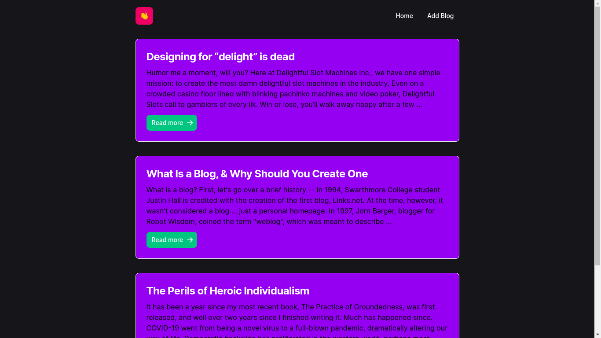
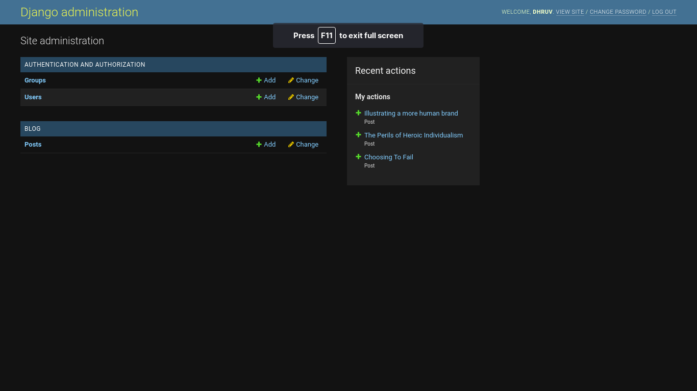

# Blog-It 📰️

> A simple django blogging web application. ✅️




## Requirements  (Prerequisites) 📝
Tools and packages required to successfully install this project.
* Python3.7 🐍 and up [Install](https://python.org) 
* npm [Install](https://github.com/nvm-sh/nvm)

## Running Demo 🔨
A step by step list of commands / guide that informs how to run an instance of this project in linux.
```sh
 $ git clone https://github.com/ogdhruv/blog-it.git

 $ cd blog-it

 $ python -m venv .venv

 $ source .venv/bin/activate

 $ pip install -r requirements.txt

 $ cd jstools

 $ npm run build

 $ python ../manage.py makemigrations

 $ python ../manage.py runserver
```


## Features 🌟

* Used Tailwind CSS to make it 100% responsive
* Used Django for Back-end Development
* Made a simple CRUD-based blogging page.


## Tech Stack / Built With 📜️

1. [Django](https://www.djangoproject.com/)- A web framework
2. [Tailwind CSS](https://tailwindcss.com/) - Rapidly build modern websites without ever leaving your HTML.

> ⚠️ Note: If you do not know how to configure  `tailwindcss` with `django`. [click-here](https://django-tailwind.readthedocs.io/en/latest/installation.html)

## Screenshot


## Contribution 🤝
- Want to contribute? Feel free to open a PR! 😸

Please open an issue first to discuss what you would like to change. If you'd like to contribute, please fork the repository and make changes as you'd like. Pull requests are warmly welcome.

Steps to contribute:
1. Fork this repository [blog-it](https://github.com/ogdhruv/blog-it.git)
2. Create your feature branch (git checkout -b feature/foobar)
3. Commit your changes (git commit -am 'Add some fooBar')
4. Push to the branch (git push origin feature/fooBar)
5. Create a new Pull Request

## Authors 😁️
 
#### ogDhruv
 
 You can find me here at:
[Github](https://github.com/ogdhruv)


## License
This project is licensed under the MIT License - see the LICENSE.md file for details

MIT © ogDhruv